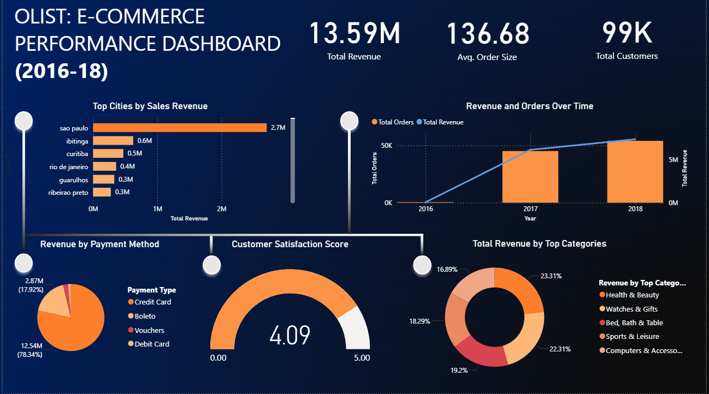

# Olist E-Commerce Performance Dashboard

## 📊 Project Overview
This is a Power BI dashboard that provides insights into the sales performance of Olist, a Brazilian e-commerce platform, from 2016 to 2018. The project visualizes key metrics such as revenue trends, top-selling cities and categories, and customer payment preferences.

## 🚀 Features
- **Total Revenue & Order Tracking:** View sales performance over time.
- **Geographic Analysis:** Identify top-performing cities in Brazil.
- **Product Category Breakdown:** See which categories generate the most revenue.
- **Payment Method Analysis:** Understand customer payment preferences.

## 🛠️ Built With
- **Tool:** Microsoft Power BI
- **Languages:** DAX, M (Power Query)
- **Data Source:** [Olist E-Commerce Dataset](https://www.kaggle.com/datasets/olistbr/brazilian-ecommerce)

# Dashboard Preview

## 🔍 Key Insights
1.  Credit card is the most popular payment method, constituting over 78% of total revenue.
2.  São Paulo is the highest revenue-generating city by a significant margin.
3.  The Health & Beauty and Watches & Gifts categories are among the top revenue drivers.

## 📁 Files in this Repository
- `project.ss.png` - A screenshot of the dashboard.

